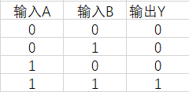
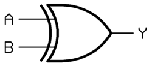
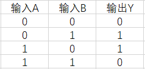
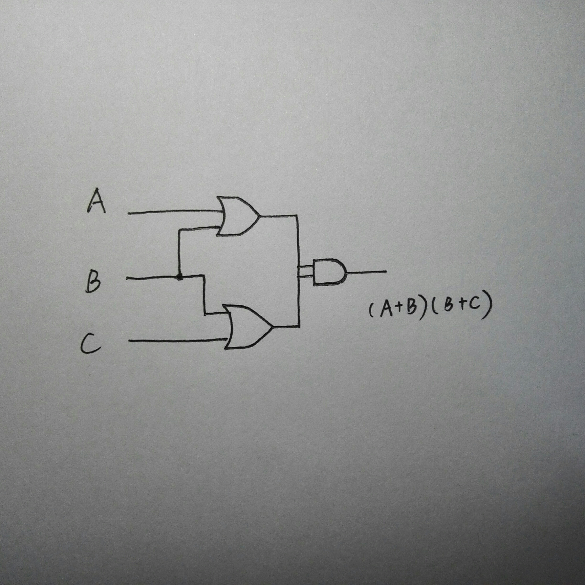
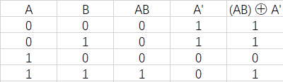
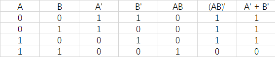
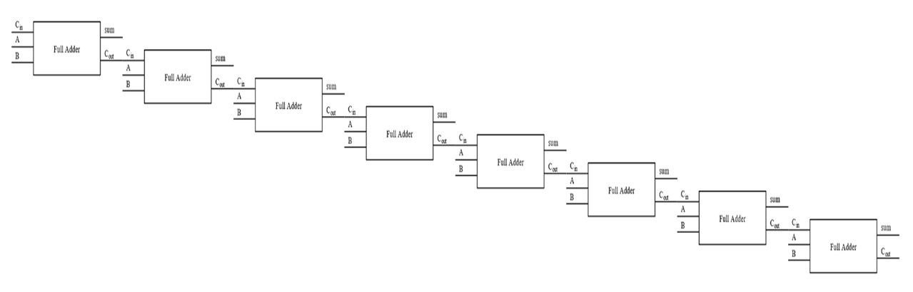

# **第五次课后作业**
## **·** 简答

1) AND gate

   – Boolean Expressions: Y = AB；

   – Logic Diagrams Symbol: 

   

   – Truth Tables: 

   

2) XOR gate

   – Boolean Expressions: Y = A ⊕ B；

   – Logic Diagrams Symbol: 

   

   – Truth Tables: 
     
   

3) The following is the Logic Diagrams Symbol:

   

4) The following is the Truth Table:
   
   

5) Circuit equivalence means the same output for each corresponding input-value combination for two circuits.

   The following is the Truth Table:

   

   From the last two columns we can see that the formula (AB)' = A' + B' is right.

6) The following is an 8bit adder circuit.

   

7) (1) X8 X7 X6 X5 X4+1 X3+1 X2+1 X1+1

   (2) X8⊕0 X7⊕0 X6⊕0 X5⊕0 X4⊕1 X3⊕1 X2⊕1 X1⊕1

   (3)X8 X7 X6 X5 X4' X3' X2' X1'

## **·** 名词解释

### ***Logic gate***
In electronics, a logic gate is an idealized or physical device implementing a Boolean function; that is, it performs a logical operation on one or more binary inputs and produces a single binary output. 

在电子学中，逻辑门是实现布尔函数的理想化或物理设备，也就是说，它可以实现对一位或多位二进制数输入的逻辑操作以及单个二进制数的输出。

### ***Boolean algebra***
In mathematics and mathematical logic, Boolean algebra is the branch of algebra in which the values of the variables are the truth values true and false, usually denoted 1 and 0 respectively. 

在数学与数学逻辑中，布尔代数是代数的分支，其变量的值是真值中的真和假，通常分别表示为1和0。

## **·** 存储电路
1) Flip-flop的中文翻译是触发器。

2) SR锁存器一次存储单个比特的信息。