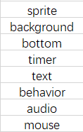
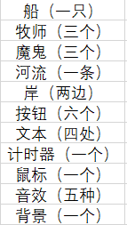
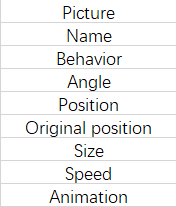
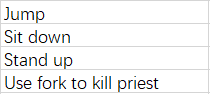

# 第九次课后作业
## “牧师与魔鬼过河”游戏实验

**· 游戏涉及哪些类？请列表说明。**

**· 游戏中有哪些对象？各有几个？例如：船（一个）。**

**· 类和对象的区别是什么？举一个例子说明。**

&emsp;&emsp;对象是人们要进行研究的任何事物。而具有相同特性（数据元素）和行为（功能）的对象的抽象就是类。也就是说，对象的抽象是类，类的具体化就是对象，也可以说类的实例是对象，类实际上就是一种数据类型。

&emsp;&emsp;比如，学生是类，具体的某个学生是对象。

**· 游戏中的魔鬼，有哪些属性和方法？**

属性：

方法：

**· 假设魔鬼被鼠标点中，会执行onclick事件，请用文字（伪代码）描述这个事件中魔鬼与其他对象沟通的过程。**

Onclick

IF(devil is on the bank) 
&emsp;&ensp;Then(devil jumps into the boat) 
ELSE(devil jumps onto the bank) 
ENDIF

**· 类或对象会是动词吗？**

&ensp;不会。

