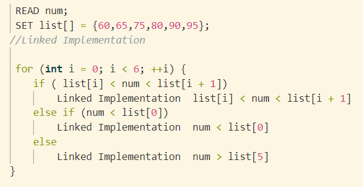

# 第十次课后作业

**1、Bubble Sort the list: 33, 56, 17, 8, 95, 22。Make sure the final result is from small to large. Write out the list after the 2nd pass.** 

  &emsp;&emsp;33,56,17,8,95,22 

  &emsp;&emsp; Bubble sort: 
  
  &emsp;&emsp;33,17,56,8,95,22 
  &emsp;&emsp;33,17,8,56,95,22 
 &emsp;->33,17,8,56,22,95 
  &emsp;&emsp;17,33,8,56,22,95 
  &emsp;&emsp;17,8,33,56,22,95 
  &emsp;&emsp;17,8,33,22,56,95 
&emsp;->17,8,33,22,56,95 
  &emsp;&emsp;8,17,33,22,56,95 
&emsp;->8,17,22,33,56,95 

**2、Give a sorted array as list={60,65,75,80,90,95}. Design an algorithm to insert the value of x into the sorted array. Then test the algorithm with value 50,67,99. 思考：为什么选择插入点在list头上、中间、尾巴上的三个数作为算法测试的数据，你能解释吗？**

&ensp;&ensp;Algorithm: ( C language )

&emsp;&emsp;思考：选择插入点在list头上、中间、尾巴上的三个数作为算法测试的数据，即二分法思想，可以使平均查找次数大大减少。

**3、 What is the state of the stack after the following sequence of Push and Pop operations?**

&emsp;&emsp;**Push “anne”; Push “get”; Push “your” ; Pop; Push “my” Push “gun” .**

&emsp;&emsp;State: gun my get anne
