# **那些年我们入坑的第一支Lamy...**

  &emsp;&emsp;众所周知，Lamy Al-star 和 Lamy Safari 是 LAMY 笔友们的入门系列钢笔，这二者购买人数最多，也最受欢迎。关于这两款 LAMY 骨灰级产品，笔者根据自身对 LAMY 的了解尝试做了一个简略的对比测评，以供参考。

## 1、外观

### **·&ensp;材质篇**
  &emsp;&emsp;用过这两个系列的钢笔的朋友应该知道，它们最大的不同就是笔身的材质。如果你手中有一支 Al-star 和一支 Safari ,对比着看，很容易感受到 Al-star 的铝合金质感和 Safari 的 ABS工程塑料质感。尽管铝比塑料重一点，但总体而言，这两款钢笔本身就很轻。
 
  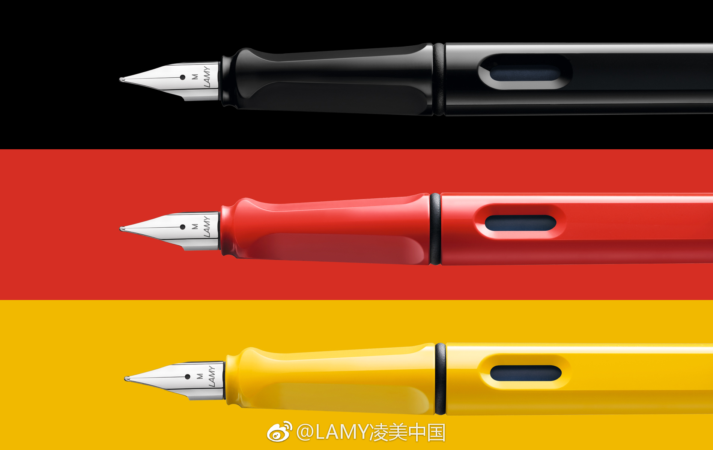
### *上图为 Safari，下图为 Al-star。*
  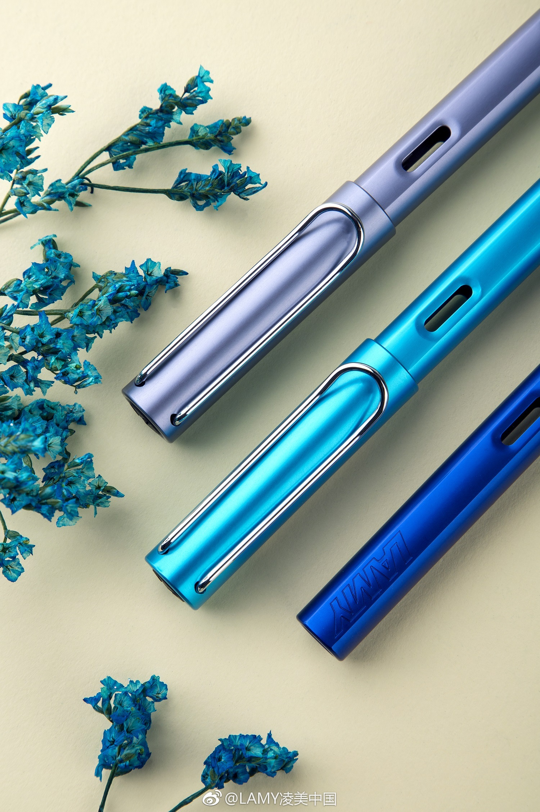

  &emsp;&emsp;材质的不同也影响了不同审美的人们对其的不同选择。铝制品看着更有质感，色泽更为柔和，但因为是金属，其表层也比较容易被刮花或掉漆，而塑料的抗划能力相对要强大一些，在美观上稍逊一筹。当然，对于不同材质的喜好因人而异。

  &emsp;&emsp;在普通高光款的基础上，Safari还增加了磨砂款，大幅提升了人们对 Safari 手感与颜值的认可度，磨砂款成为爆款。

  &emsp;&emsp;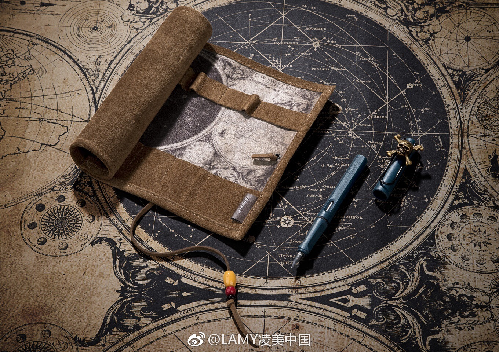

  &emsp;&emsp;因为金属质感，Al-star 重量适中，书写体验更加优秀。

  &emsp;&emsp;因为轻便易携，Safari 可以随身携带，带个小本，说走就走，记录生活。

  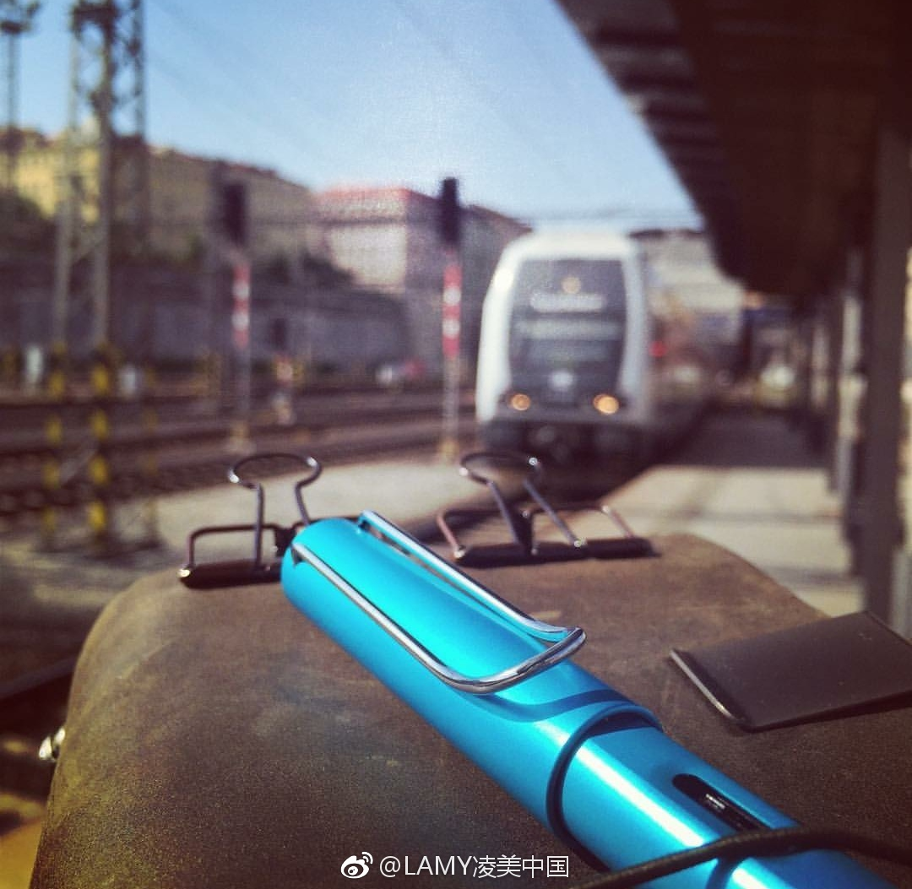

### **·&ensp;细节篇**

  &emsp;&emsp;半透明笔握与铝合金的搭配，使 Al-star 极具现代感；而 Safari 手握部分则延续了笔身的配色，更显青春活力。

  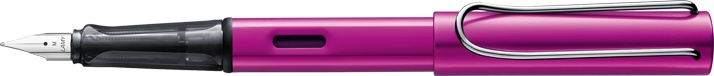
  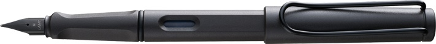

  &emsp;&emsp;或许是为了更好展现出各自的轮廓美，Al-star 和 Safari 在笔杆上有一些细小差别。仔细观察可以看出，Al-star 笔身x相对圆滑，而 Safari 在其 logo 两面呈平直状。
  
  &emsp;&emsp;笔帽部分，两者没有显著差异，只是 Al-star 笔帽略微“胖”一点。
  
  &emsp;&emsp;至于笔尾的颜色， Safari 是随着笔的颜色改变的。而 Al-star 不会改变，都是黑色。

## 2、手感

  &emsp;&emsp;前文提到，由于材质的不同，Al-star 和 Safari 书写手感明显不同。众多LAMY粉亲测表示，Al-star 带给了他们更多书写的厚实感， 而 Safari 轻巧飘逸，甚至飘得有点过了，对于追求书写体验的笔友来说，Al-star 也许是更好的选择。

  &emsp;&emsp;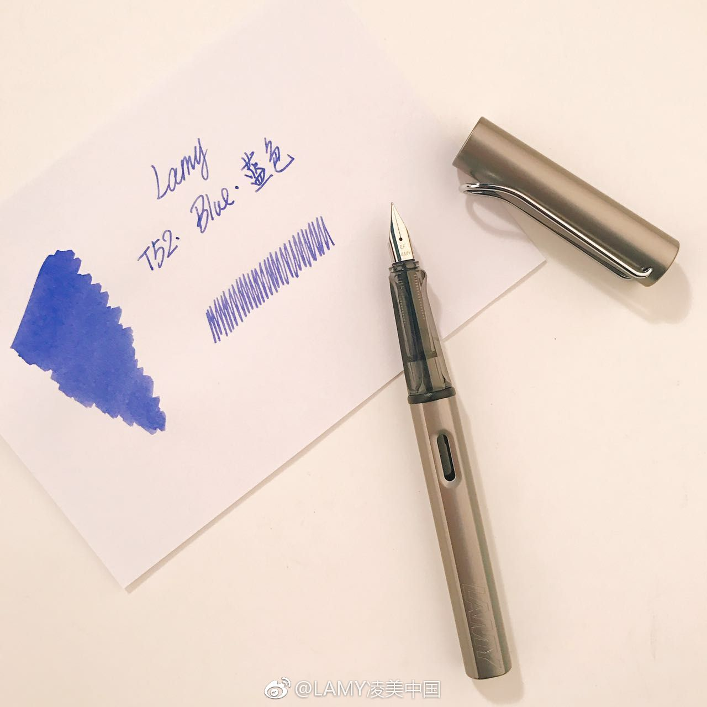

  &emsp;&emsp;在笔尖的处理上，除了部分限量款对笔尖颜色进行调整外，LAMY 对 Al-star 和 Safari 则持相同态度。书写流畅，阻尼感不明显，易出笔锋且不易飞白等，都是值得 LAMY 用户认可这两款产品的特性。

## 3、优缺点

### *·&ensp;Safari*

  &emsp;&emsp;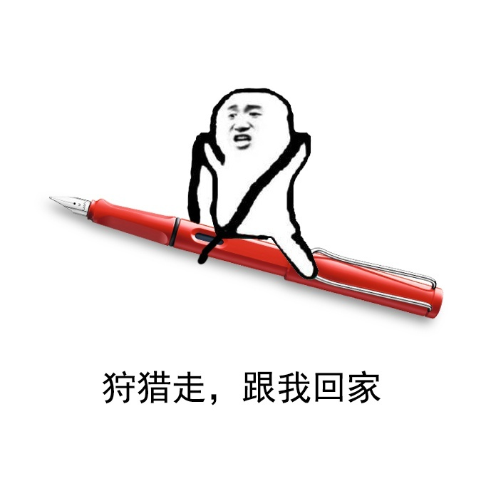

  &emsp;&emsp;**优点**：
  
  &emsp;&emsp;· 对于对钢笔没有特殊爱好的年轻人来说，设计简洁大方的 Safari 易与其他钢笔区分开，不显“老气”。

  &emsp;&emsp;· 书写流畅，出水稳定。
  
  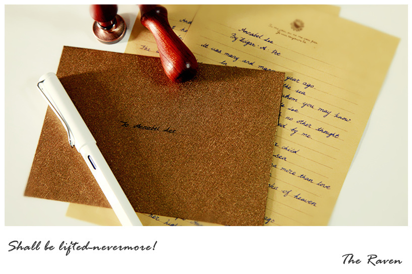

  &emsp;&emsp;**缺点**：

  &emsp;&emsp;· 性价比一般，与同等价位钢笔相比稍逊。

  &emsp;&emsp;· 受人工打磨影响，笔尖表现有细小差异。

### *·&ensp;Al-star*

  &emsp;&emsp;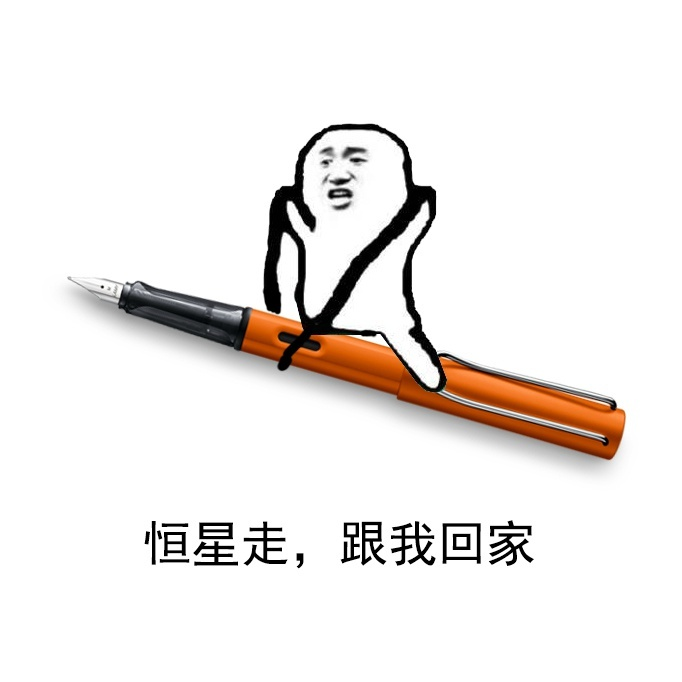

  &emsp;&emsp;**优点**：

  &emsp;&emsp;· 模块化设计，有金属质感。

  &emsp;&emsp;· 笔握透明，可看到毛细。

  &emsp;&emsp;· 颜色选择众多，更有限量款与周年纪念款的加持，Al-star 庞大的家族给了笔友们无限的选择空间。
  
  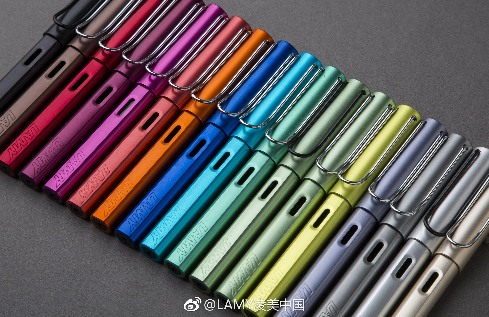

  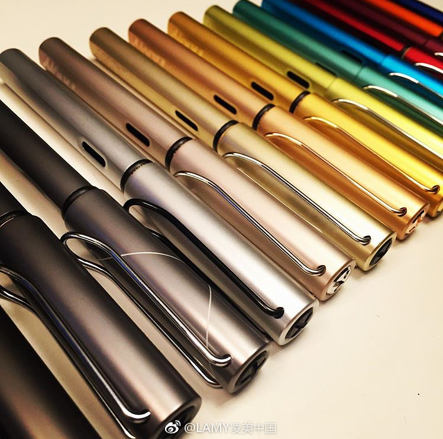

  &emsp;&emsp;**缺点**：

  &emsp;&emsp;· 铝合金制品较塑料而言易变形。

  &emsp;&emsp;· 受汇率影响，价格偏高。

 

##### &emsp;&emsp; 作者：Sherry ;    &emsp;&emsp; 图源自微博@LAMY凌美中国、百度贴吧等，如有侵权，请联系删除。
