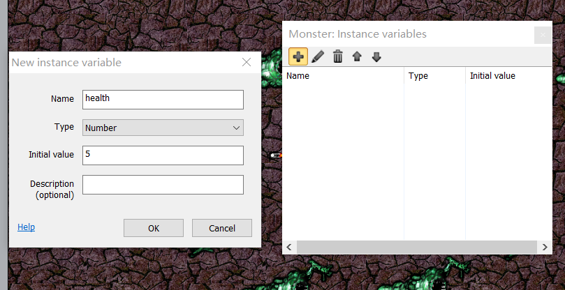

# 使用Construct2制作的打飞机游戏
【简单介绍一波【这是一个借鉴某网络达人制作的

建新文件
素材准备
## **背景插入**
&emsp;&emsp;首先从网上搜寻保存合适的背景图，双击布局空白处，如图，选择"Titled Background",待出现一个十字准线，指示放置对象的位置并单击，此时纹理编辑器会打开，单击文件夹图标以从背景图保存路径中找到背景图选择它。

&emsp;&emsp;关闭纹理编辑器，布局上出现我们想要的背景。然后调整它以覆盖整个布局。确保选中它，在左侧的属性栏中将其位置设置为0,0（布局的左上角），并将其大小设置为1280,1024（布局的大小）。

此时布局背景如图所示：

## **添加对象**
&emsp;&emsp;将图像从其所在的文件路径中拖放到布局区域即可创建"Sprite"对象（即游戏对象）。注意，一定要一次拖动每个图像。如果一次拖动所有四个图像，Construct 2将生成一个带有四个动画帧的"Sprite"对象。

&emsp;&emsp;为了方便，我们对所有对象重命名。在左侧的属性栏逐一对每个对象重命名。

&emsp;&emsp;因该游戏主要使用鼠标操作，故添加鼠标对象。

## **添加行为**
&emsp;&emsp;下面为player添加"8Direction"行为。单击播放器以选择它。

&emsp;&emsp;执行相同操作，继续添加"Scroll To"和"BoundToLayout"行为，使屏幕跟随播放器，以及绑定到布局行为，以使它们保持在布局中：

&emsp;&emsp;接着为其他对象添加行为：
- 将"Bullet movement"和"Destroy outside layout"添加到Bullet
- 将"Bullet movement"添加到Monster
- 将"Fade"添加到Explosion

&emsp;&emsp;为了更好的游戏体验，将Monster的速度从400更改为80，，将Bullet的速度更改为600，将Explosion的Fade行为的Fadeout时间更改为0.5秒。

&emsp;&emsp;

&emsp;&emsp;

&emsp;&emsp;此时可以通过复制Monster来增加其数量（数量不限）。按住Control键，单击并拖动Monster对象到合适位置。

## **添加活动**
&emsp;&emsp;单击标签页的"Event sheet1"，我们将在上面添加游戏对象的所有活动。如图，单击"Add event"，在弹出的窗口中依次单击"System">>"Next">>"Every tick"。第一个事件添加完成。

&emsp;&emsp;再为该事件添加活动。如图，单击"Add action"，在弹出的窗口中依次单击"player">>"Next">>"Set angle toward position"，为了让player紧跟鼠标，角度设置为鼠标位置，即输入Mouse.X为X、Mouse.Y为y。

&emsp;&emsp;继续添加下图一系列事件，操作类似。

&emsp;&emsp;

&emsp;&emsp;其中：

1) 为使子弹从枪尾射出，我们将通过在枪的末端放置一个图像点来解决这个问题。右键单击项目或对象栏中的播放器，然后选择"Edit animations"。播放器的图像编辑器出现后，单击原点和图像点工具，并打开图像点对话框：

&emsp;&emsp;

&emsp;&emsp;

2) 为消除爆炸效果的黑色背景，单击右下角的对象栏中的Explosion对象，或单击项目栏（带有图层栏的选项卡）。其属性显示在左侧的属性栏中。在底部，将其Blend mode属性设置为Additive。

3) 假设我们想要让怪物在射击五次后才死亡，我们将存储一个"Health"计数器，这可以通过实例变量做到这一点。选择Monster对象。在属性栏中单击编辑变量进入窗口设置。

&emsp;&emsp;

## **成果展示**

