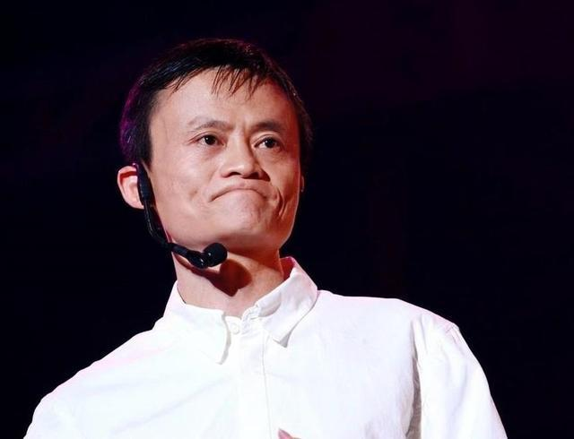
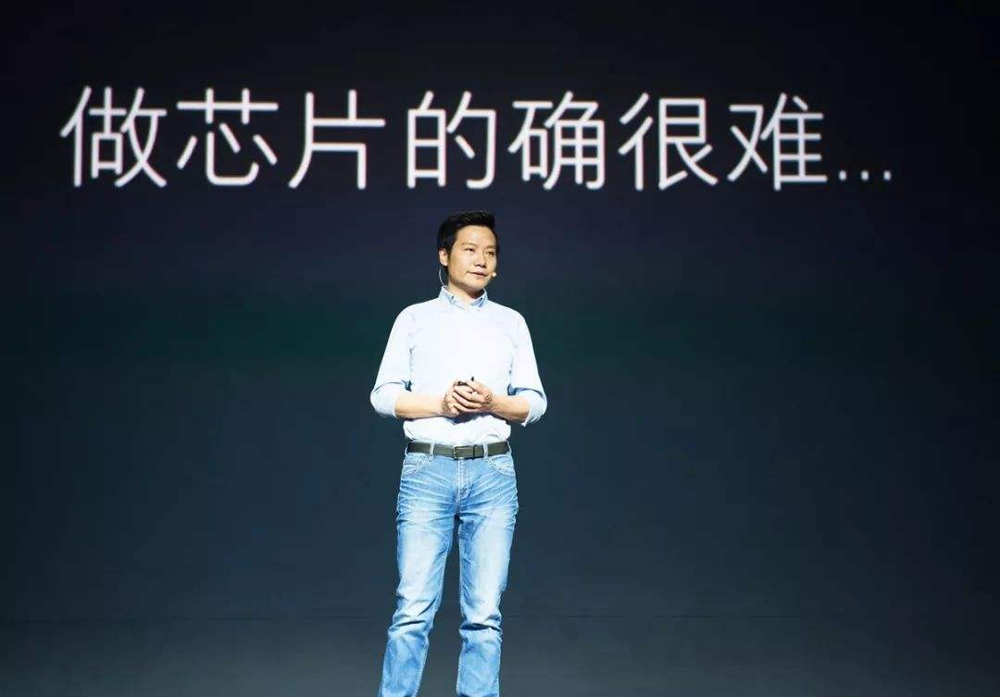
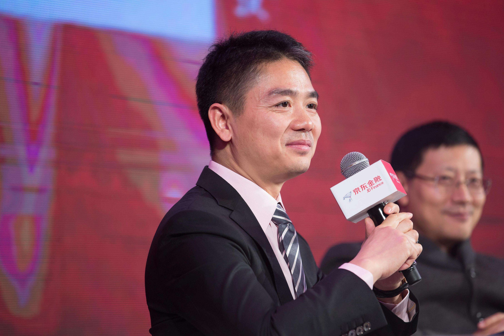
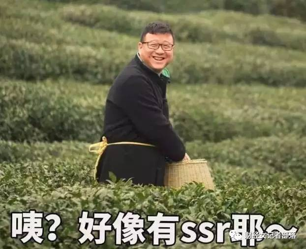
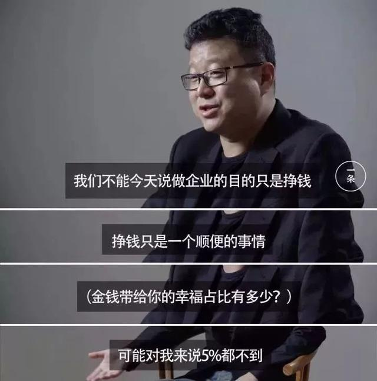
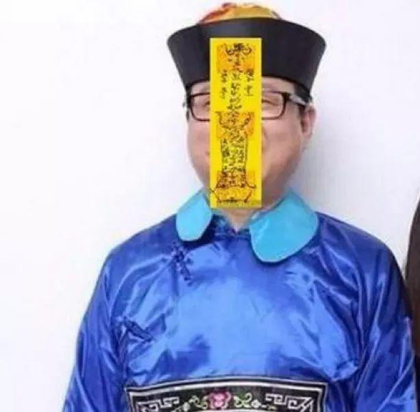
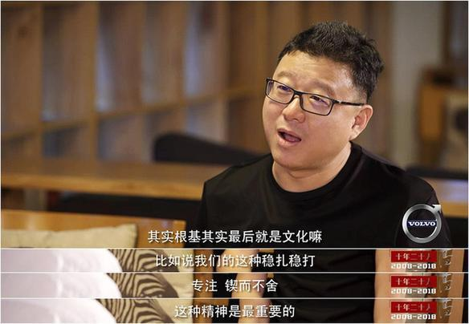
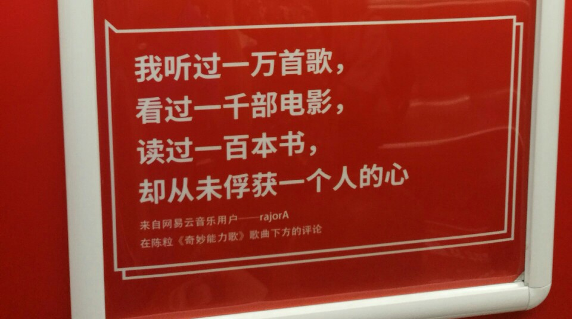
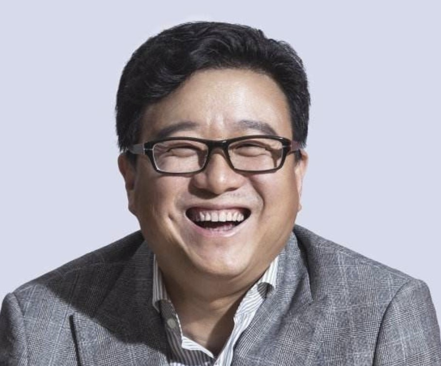

# **丁磊和他的网易们...**
&emsp;&emsp;财经专栏作家吴晓波有一次在参加《铿锵三人行》节目时说自己见过的大富豪中几乎没有一个是真快乐。“哦,是有一个,丁磊。”追问之下,吴晓波又补充了一句。 
### **· 有钱的丁磊千亿身价，有趣的丁磊万里挑一** 
&emsp;&emsp;有钱的科技大佬都是怎样的？ 
&emsp;&emsp;比如马老板这样的，一个月赚几十亿不开心▽ 

 

&emsp;&emsp;比如雷老板这样的，偶像包袱太重，每天担心失败▽ 

 

&emsp;&emsp;比如刘老板这样的，搞不定融资一夜白头▽ 

 

&emsp;&emsp;有钱且快乐的稀有企业家物种丁磊就不一样了，他的画风是这样的▽ 

 

&emsp;&emsp;接受一条采访时，谈及赚钱与幸福，丁磊称，赚钱只是一个顺便的事情。金钱能给到的幸福只占 5% 都不到。 
 
&emsp;&emsp;一个财务自由的人，金钱带来的边际效用是快速递减的，金钱能给的幸福上限是有限的，你所能喜欢的东西都可以被钱交换后，追求精神层面的生活，显然要更重要。这样的丁磊，人到中年了，又活回去了，变成了一个大男孩。 
&emsp;&emsp;大男孩的意思是，做了什么事情，可能真的就是为了做这么件事，就是为了好玩、为了参与感、为了生活的丰富性，甚至为了理想。 
&emsp;&emsp;挣钱、公关都是“顺便的事”，而不是主要的事。 
&emsp;&emsp;在公关部门的授意下，BOSS以个人身份参与到产品中，也算是互联网常态了。 
&emsp;&emsp;但目的的不同，决定事情本质的区别。 
&emsp;&emsp;以公关、挣钱为主，娱乐只是顺便的事，甚至根本就是一件累人的差事，不得不去“应付”，这样的参与是一个商人的费劲心机。 
&emsp;&emsp;就是为了玩，公关是公关部门的事，挣钱是运营部门的事，都是顺便的事，这样的参与，是丁磊这个大男孩的开心、随性和自由。 
&emsp;&emsp;比如，为《倩女幽魂》手游宣传，丁磊穿着财神服，完成了作为“男神”的cos首秀，顺便捧红了网易最具网红气质的厂花——“猪小花”；爆款手游阴阳师，丁磊“亲临现场”直播，各种烧香、敬神、拜佛然而二十连抽全无SSR，做了回实实在在的“非洲大酋长”。 

 

&emsp;&emsp;而网易游戏的那点调性，和丁磊个人的真性情及其对网易整体文化的影响是分不开的。 
### **· 真正圈粉的，还是网易的产品**
&emsp;&emsp;当我们在PC手机上安装网易的任何产品时，不用担心“全家桶”现象，也不用担心软件还没装完，一堆“生态关联”的阿猫阿狗软件争着跑出来说，点我，装我，快要我！更不用担心下载一个被莫名其妙赠送十个的优惠大酬宾。 
&emsp;&emsp;在丁磊眼中，产品就是产品，产品之事，就是精益求精、思考如何更好地为了特定群体服务，不用刻意为之去做所谓“产品生态”、做平台、做游戏规则。 

 

&emsp;&emsp;事实上，比起追风口和投资，丁磊显然更看重对自身的产品和所在领域的专注。在以往的采访中,丁磊曾自评是个“90分的产品经理”，对产品品质、用户体验有着极致的追求。在《铿锵三人行》节目中，吴晓波也表示，如果说中国互联网圈最优秀的产品经理有两个，那么除了丁磊，另一个就是马化腾了。 
&emsp;&emsp;兴趣和商业好奇心是网易很多产品孵化的源头，那么丁磊追求的“社会贡献”则是这些产品的评价准绳。 
&emsp;&emsp;比如做网易云音乐。 
&emsp;&emsp;——为什么要做一款音乐软件？ 
&emsp;&emsp;——你能享受到无损音质。 
&emsp;&emsp;丁磊说，另外它的智能推荐非常棒，我们一直在想，怎么能够利用一个平台，让非常好的音乐被放大化。 
&emsp;&emsp;90年代，丁磊大学毕业参加工作，每天下班后跟室友倒腾发烧唱片，精力旺盛的跟周围朋友推荐隐秘的小众音乐，在音乐的世界里，他感到快乐和自由。网易云音乐上线后，丁磊是最忠实用户，听歌排行里，他的数字是8510首，从上海话民谣到西班牙语小调，同时覆盖二次元动漫和交响乐。 
&emsp;&emsp;云音乐黑胶唱片播放页面备受喜爱，当初为了确定黑胶唱片的转动速度，丁磊和网易音乐的产品团队，搬来一台黑胶唱片，观察唱片播放场景，前后调了至少20个版本才确定，一分钟三转，丁磊说这是让用户感受最舒适的速度。 
&emsp;&emsp;通过功能创新和对音乐品质的追求，扩大了消费者收听的广度和泛度，提高了千千万万中国人的音乐品味——这是丁磊所追求的网易云音乐。 

### **· 过尽千帆，归来仍是少年**
&emsp;&emsp;丁磊属年少成名，但并非一帆风顺。 
&emsp;&emsp;2000年，网易赴美上市，创业仅3年的丁磊风光无两，结果一年后，互联网泡沫全速破灭。新浪、网易和搜狐先后跌至历史最低，其中网易最惨，股价一度只有53美分。这还没完，2001年9月，纳斯达克以财报存疑为由，宣布网易股票停止交易，这是中国公司第一次在美股被停牌。丁磊说，那时很迷茫，连卖掉网易的心都有过，最后没卖不是因为心气高，而是财务审计有问题，别人不肯买。 
&emsp;&emsp;他当时问步步高创始人段永平，能不能卖掉公司再开一家。 
&emsp;&emsp;段永平反问：你现在就有一家公司，为什么不把它做好呢？ 
&emsp;&emsp;丁磊如梦初醒，尝试转型，投资开发了网络游戏《大话西游》，同时和运营商合作开发短信业务——“移动梦网”，这个业务当年也救活了腾讯。 
&emsp;&emsp;就这样，丁磊带领网易率先走出寒冬。2002年初，网易复牌，同年第四季度，实现盈利，成为中国首家实现盈利的互联网公司。 
&emsp;&emsp;2003年，丁磊登上中国内地百富榜首位，而前一年，他根本不在榜上。 
低谷与高峰之间，又有多少难以细数的坎坷呢？网易泡泡没能打赢腾讯QQ，手下坚持要做的微博也没成功；邮箱、公开课备受好评但是不赚钱；团购大战、视频大战、云盘大战，丁磊都选择不参与。
&emsp;&emsp;失之东隅，收之桑榆。除了一直稳固的游戏业务，网易在音乐、电商等领域杀成一片红海之后，慢悠悠地进场，然后创造了网易云音乐和网易严选等几乎让人费解的口碑，赢得了“网易出品，必属精品”的赞誉。 
&emsp;&emsp;年轻的丁磊，经历过天堂，也去过地狱。吴晓波曾评价丁磊，是企业家中唯一笑起来比较天真的一位，但这天真笑脸背后，不是一帆风顺，而是过尽千帆，归来仍是少年。这样看来，丁磊的有趣更难能可贵。 

### **· 新解“佛系”: 静下心做好一件事才是最高境界**
&emsp;&emsp;佛系热潮未退,匠系、道系等互联网热词又起。在被问及自己是佛系多一些还是匠系多一些时,丁磊对“佛系”一词做出了自己独特的解释。在他看来,匠系和佛系两者并不冲突,匠系本身就是佛系的一个子集。目前,大家都认为佛系就是“都好、都可以、随便”,其实佛系是趋向于一种佛家的“普世”价值观。“我对佛系的理解是,要真正能够深入到社会中去,到生产中去,把一件事情做得非常好,以产品的质量、品质、创新,最后影响到无数消费者,这个才是佛系的最高境界。” 
&emsp;&emsp;不难理解丁磊为何会做出如此阐释。出生于佛教家庭的丁磊,似乎在网易的管理中也掺进了一些“佛系”风格。比如,他在2009年选择投身农业养猪,是因为自己认为“好的东西要普世化”,希望中国人吃到安全猪肉,还有做网易公开课等等,皆是如此。这些带有情怀的产品,被认为看起来不商业,却“很互联网”,更符合他对“佛系”的定义。用他自己的话来说,网易是“一家兼具佛系和匠系的互联网公司”。 
&emsp;&emsp;这位中国非典型企业家，管理一家企业20年的秘籍：守住专注、稳扎稳打的企业文化，再加上一点点个性中的“敢做”与好奇心。或许，这就是丁磊的“佛系”生意经。 
