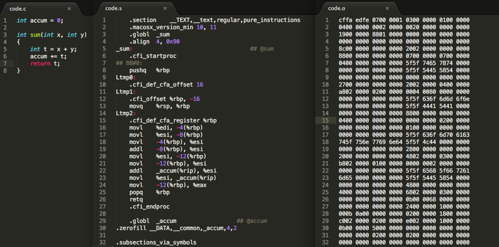
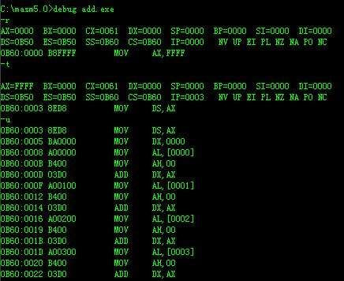
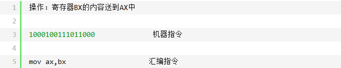
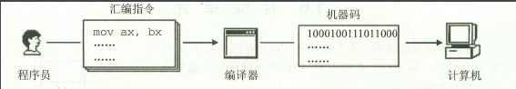
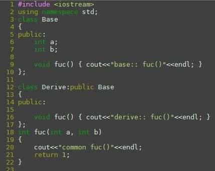
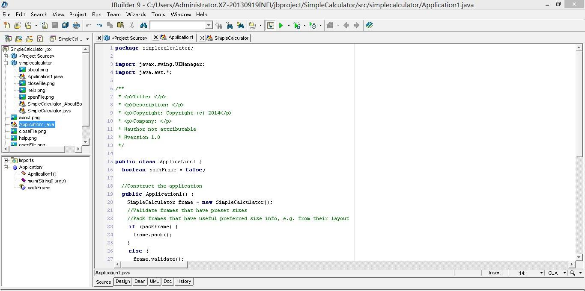
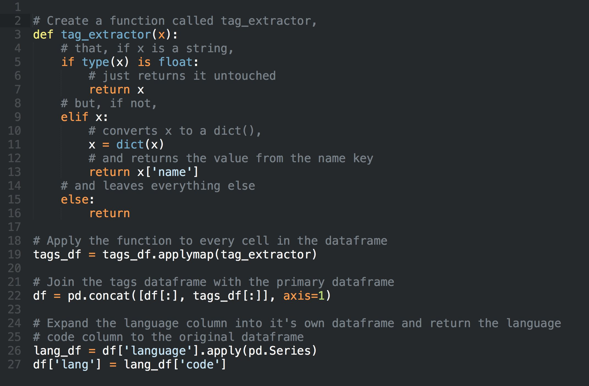

# 高级语言、汇编语言与机器语言

## **机器语言，第一代计算机语言**
&emsp;&emsp; 一个高级语言程序是经过编译器翻译为汇编语言，然后通过汇编器转变成机器代码，最后被计算机识别并执行。

&emsp;&emsp; 其中，机器语言是用二进制代码表示的计算机能直接识别和执行的一种机器指指令系统令的集合。它的存在是由于计算机无法直接识别我们所编写的C程序或者Java程序等而只能识别“0”或“1”。 

&emsp;&emsp; 早期的程序设计均使用机器语言。程序员们将用0, 1数字编成的程序代码打在纸带或卡片上，1打孔，0不打孔，再将程序通过纸带机或卡片机输入计算机，进行运算。

&emsp;&emsp; 计算机使用由"0"和"1"组成的二进制数，二进制是计算机的语言的基础。因此程序就是一个个的二进制文件。一条机器语言成为一条指令。指令是不可分割的最小功能单元，即每条机器语言指令只能执行一个非常小的任务。在机器语言中，处理过程中每个微小步骤都必须有明确的编码。即使是求两个数的和，也需要用3条二进制指令来编写。

&emsp;&emsp;例如，在8086/8088兼容机上，用机器语言完成求5+6的程序代码：

&emsp;&emsp;10110000 00000101；将5放进累加器acc中.

&emsp;&emsp;00101100 00000110；累加器的值与6相加，结果仍然在累加器中.

&emsp;&emsp;11110100；停机结束.

&emsp;&emsp;将它输入以8086微处理器为CPU的计算机中，就能直接执行它。

&emsp;&emsp; 用机器语言编写程序，编程人员要首先熟记所用计算机的全部指令代码和代码的涵义。手编程序时，程序员得自己处理每条指令和每一数据的存储分配和输入输出，还得记住编程过程中每步所使用的工作单元处在何种状态。这是一件十分繁琐的工作。编写程序花费的时间往往是实际运行时间的几十倍或几百倍，而且，编出的程序全是些0和1的指令代码，直观性差，还容易出错。即使智力超群的程序员也常常会顾此失彼，屡出差错，因而所编出的程序可靠性差，开发周期长。

&emsp;&emsp;&emsp;&emsp;&emsp;&emsp;&emsp;&emsp;&emsp;&emsp;&emsp;&emsp;&emsp;&emsp;&emsp;&emsp;&emsp;&emsp;&emsp;~眼花缭乱~

&emsp;&emsp; 那么该怎么办呢？这时候汇编语言便产生了。

&emsp;&emsp; 而现在除了计算机生产厂家的专业人员外，一般是不需要学习机器语言了。

## 汇编语言，人机的桥梁

&emsp;&emsp; 为了减轻使用机器语言编程的痛苦，人们进行了一种有益的改进：用一些简洁的英文字母、符号串来替代一个特定的指令的二进制串，比如，用"ADD"代表加法，"MOV"代表数据传递等等，这样一来，人们很容易读懂并理解程序在干什么，纠错及维护都变得方便了，这种程序设计语言就称为汇编语言，即第二代计算机语言。然而计算机是不认识这些符号的，这就需要一个专门的程序，专门负责将这些符号翻译成二进制数的机器语言，这种翻译程序被称为汇编程序。

&emsp;&emsp;

&emsp;&emsp;汇编语言的主体是汇编指令。汇编指令和机器指令的差别在于指令的表示方法上，汇编指令是机器指令便于记忆的书写格式。

&emsp;&emsp;比如下面将寄存器 BX 的内容发送到 AX 上：

&emsp;&emsp;我们能很明显的从上面两条指令看出区别，汇编指令相对于机器指令是很容易记住的。

&emsp;&emsp;可能有人会问，我们用汇编语言编写程序，可是计算机只认识机器指令，那该怎么办？这时候就需要一个能将汇编语言转换成机器指令的工具，我们称其为编译器。程序员用汇编语言写出源代码，再用汇编编译器将其编译为机器码，最后由计算机执行。

&emsp;&emsp;汇编语言是直接面向处理器的程序设计语言。处理器是在指令的控制下工作的，处理器可以识别的每一条指令称为机器指令。每一种处理器都有自己可以识别的一整套指令，称为指令集。处理器执行指令时，根据不同的指令采取不同的动作，完成不同的功能，既可以改变自己内部的工作状态，也能控制其它外围电路的工作状态。

&emsp;&emsp;汇编语言的另一个特点就是它所操作的对象不是具体的数据,而是寄存器或者存储器，也就是说它是直接和寄存器和存储器打交道，这也是为什么汇编语言的执行速度要比其它语言快，但同时这也使编程更加复杂，因为既然数据是存放在寄存器或存储器中，那么必然就存在着寻址方式，也就是用什么方法找到所需要的数据。例如上面的例子，我们就不能像高级语言一样直接使用数据，而是先要从相应的寄存器AX、BX 中把数据取出。这也就增加了编程的复杂性，因为在高级语言中寻址这部分工作是由编译系统来完成的，而在汇编语言中是由程序员自己来完成的，这无异增加了编程的复杂程度和程序的可读性。

&emsp;&emsp;再者，汇编语言指令是机器指令的一种符号表示，而不同类型的CPU 有不同的机器指令系统，也就有不同的汇编语言,所以，汇编语言程序与机器有着密切的关系。所以，除了同系列、不同型号CPU 之间的汇编语言程序有一定程度的可移植性之外，其它不同类型（如：小型机和微机等）CPU 之间的汇编语言程序是无法移植的，也就是说，汇编语言程序的通用性和可移植性要比高级语言程序低。

&emsp;&emsp; 尽管如此，但汇编语言的效率仍十分高，针对计算机特定硬件而编制的汇编语言程序，能准确发挥计算机硬件的功能和特长，程序精炼而质量高，所以至今仍是一种常用而强有力的软件开发工具。

## 高级语言
&emsp;&emsp; 从最初与计算机交流的痛苦经历中，人们意识到，应该设计一种这样的语言，这种语言接近于数学语言或人的自然语言，同时又不依赖于计算机硬件，编出的程序能在所有机器上通用。经过一系列努力，1954年，第一个完全脱离机器硬件的高级语言 —— FORTRAN问世了。半个世纪多以来，共有几百种高级语言出现，有重要意义的将近几十种，而影响较大、使用较普遍的有FORTRAN、ALGOL、COBOL、BASIC、LISP、SNOBOL、PL/1、Pascal、C、PROLOG、Python、Ada、C++、VC、VB、Delphi、JAVA等。

&emsp;&emsp;&emsp;&emsp;&emsp;&emsp;&emsp;&emsp;&emsp;&emsp;&emsp;&emsp;&emsp;&emsp;（依次为C++、Java、Python）

&emsp;&emsp; 高级语言的发展也经历了从早期语言到结构化程序设计语言，从面向过程到非过程化程序语言的过程。相应地，软件的开发也由最初的个体手工作坊式的封闭式生产，发展为产业化、流水线式的工业化生产。

## C语言： 

&emsp;&emsp;C语言是介于汇编语言和高级语言之间的语言，属于高级语言，也称为中级语言，是集汇编和高级语言优点于一身的程序设计语言。于1972年在美国贝尔实验室里问世。早期的C语言主要用于UNIX系统。由于C语言的强大功能和各方面的优点逐渐为人们认识，到了九十年代，C语言开始进入其他操作系统，并很快在各类大、中、小和微型计算机上得到广泛的应用。成为当代最优秀的程序设计语言之一。 

#### C语言的特点 
1) 是一种结构化语言。层次清晰，便于按模块化方式组织程序，易于调试和维护。 
2) C语言的表现能力和处理能力极强。不仅具有丰富的运算符和数据类型，便于实现各类复杂的数据结构，它还可以直接访问内存的物理地址，进行位级别的操作。 
3) 由于C语言实现对硬件的编程操作，所以既可用于系统软件的开发，也适合于应用软件的开发。C语言还具有效率高，可移植性强等特点。因此广泛地移植到了各类计算机上，从而形成了多种版本的C语言。 
4) 由于C语言允许直接对位、字节和地址进行操作，能实现汇编语言的大部分功能。 
5) 目标代码质量高，程序执行效率高。 

&emsp;&emsp;总体上来说，C语言的优点是简洁、紧凑、使用方便、灵活、易于学习和应用。仅有32个关键字。9种控制语句，程序的书写形式也很自由。

&emsp;&emsp;C语言的弱点：非强类型；语法限制不严格，使得编程者无法过多地依赖C编译程序去查错；缺少实时检查，如数组越界等。 

&emsp;&emsp;从严格上来说，C语言是块结构语言，这是因为它在结构上类似于ALGOL、Pascal和Modula-2。从技术上讲，块结构语言允许在过程和函数中定义过程和函数。因为C语言不允许在函数中定义函数，所以不能称为通常意义上的块结构语言。 

&emsp;&emsp;C语言作为一门面向过程的计算机语言，至今已有三十多年历史，应用广泛，无论是Windows还是Linux，你所看到的底层都是用C写的。大部分的网络协议也都是用C实现的。你看到的最漂亮的游戏画面也是用C实现的，工业控制程序也是用C实现的。不过C不是万能，只是某些方面它适用而已。 

## C++语言 
&emsp;&emsp;C++是于1986年由AT&T贝尔实验室开发的，语言开发的目的在于通过数据封装减少程序变量的副作用，从而降低程序的复杂性并提高程序的可靠性。（笔者曾经听到的开发C++的目的是由于懂得C语言的人越来越多，所以需要再出一门更难的、比C语言强大的语言，才能保住饭碗，so。C++出世啦）C++是C语言的直接扩展，C++的多继承机制能更好地描述对象的属性和行为。 

&emsp;&emsp;C++是C的扩展，但C++可以作为一种全新的语言来看。 

&emsp;&emsp;C++的特点：面向对象、继承、封装、多态性。 

&emsp;&emsp;由于C++是C的扩展，所以也具有C的特点。 

&emsp;&emsp;C++在C的基础上，加入了面向对象编程思想，也就决定了++的效率在某一方面是不如C的。比如定义一种类型，C++用类（Class）来封装，而C可能就直接几个变量的组合就成了一个结构体（Struct），类不仅具有成员变量，还具有成员函数等，在精细的比较其效率时，C会比C++的效率要高。但由于时代的发展，项目或工程的庞大化，基于面向对象的思想显然更能适应。即C++在这方面能比C要做得更漂亮。现在不少系统级编程都是用C++实现，许多应用级别的软件也是用C++实现。

&emsp;&emsp;这里要注意一点，就是C++并不是完全的面向对象语言。它是提供了面向对象的模型以及思路，但是同时兼容了面向过程的模型。 

## Java语言 
&emsp;&emsp;Java语言来自于Sun公司的一个叫Green的项目，其原先的目的是为家用消费电子产品开发一个分布式代码系统，这样我们就可以把email发给电冰箱、电视机等家用电器。对他们进行控制和信息交流。开始，准备用C++，但C++太复杂，安全性差，最后用一种新的语言Oak（Java的前身），Oak是一种用于网络的精巧而安全的语言，Sun公司曾依此投标一个交互式电视项目，但被SGI打败。可怜的Oak几乎无家可归，恰巧这时Mark Ardreesen开发的Mosaic和Netscape启发了Oak项目组成员，他们用(Java)编制了HotJava浏览器，得到了Sun首席执行官Scott McNealy的支持，触发了Java进军Internet。Java的取名有一段趣闻：有一天，几位Java成员组的会员正在讨论给这个新的语言取什么名字，当时他们正在咖啡馆喝着Java（爪哇）咖啡，有一个人灵机一动说就叫Java怎样，得到了其他人的赞赏，于是，Java这个名字就这样传开了。 
#### Java的特点： 
1) 简单性：风格类似于C++，Java摒弃了C++中容易引发程序错误的地方，如指针和内存管理。 
2) 面向对象：Java是一种完全面向对象语言。从这点来看，Java类似于SmallTalk，但其特性、尤其是适用于分布式计算环境的特性远远超越了SmallTalk。 
3) 分布式：Java包括一个支持HTTP和FTP等基于TCP/IP协议的子库。因此，Java应用程序可凭借URL打开并访问网络上的对象，其访问方式与访问本地文件系统几乎完全相同。 
4) 健壮：Java致力于检查程序在编译和运行时的错误。类型检查帮助检查出许多开发早期出现的错误。Java自己操纵内存减少了内存出错的可能性。 
5) 结构中立：Java将程序编译成一种结构中立的中间文件格式。只要有Java运行系统的机器都执行这种中间代码。这种中间语言被设计在虚拟机上运行，由机器相关的运行调试器实现执行。 
6) 安全： 
1）删除了香指针和手动释放内存等功能，避免了非法内存操作。 
2）当Java用来创建浏览器时，语言功能和浏览器本身提供的功能结合起来。 
Java在机器上执行前，要经过很多测试，它经过代码校验，检查代码段的格式，检测指针操作，对象操作是否过分以及试图改变一个对象的类型。 
7) 可移植的：同体系结构无关的特性使得Java应用程序可以在配备Java解释器和运行环境的任何计算机系统上运行。任何Java代码会被解释成一种中间语言，然后通过不同机子的特定环境（如机器指令）运行程序。实现方便移植的特点。 
8) 解释性。Java解释器能直接运行目标代码指令。链接程序通常比编译程序所需资源少。 

9) 高性能。如果解释器速度不慢，Java可以在运行时直接将目标代码翻译成机器指令。Sun用直接解释器一秒钟内可调用300,000个过程。 
10) 多线程：Java提供的多线程功能使得在一个程序里可同时执行多个小任务。多线程带来的更大好处是更好的交互性能和实时控制性能。 
11) 动态：动态特性允许程序动态地装入运行过程中所需要的类。在运行时确定引用的好处是可以使用已被更新的类，而不必担心会影响原有的代码。如果程序连接了网络中另一系统中的某一类，该类的所有者也可以自由地对该类进行更新，而不会使任何引用该类的程序崩溃。 

&emsp;&emsp;Java在诞生之后不久，便受到广大群众的欢迎，甚至有人说出有了Java，可以不要C/C++了。一度把Java提到了很高的地位。这当然是对Java的一种赞赏，只是有点过了。到今天，Java依然不能取代C，C++，而且还出现了新的对手 ――.net（后面将会介绍）。 

&emsp;&emsp;Java目前主要应用：Web浏览器、网络应用系统。 

## C#语言
&emsp;&emsp;C#是一种精确、简单、类型安全、面向对象的语言。说到C#，就不得不先简单介绍一下 .net。到底什么是 .net呢，按照微软总裁兼首席执行官Steve Ballrner把它定义为：.net代表一个集合，一个环境，它可以作为平台支持下一代Internet的可编程结构。C#是 .net的代表语言。 
#### C#的特点： 
1) 完全面向对象。

2) 支持分布式，之所以有C#，是因为微软相信分布式应用程序是未来的趋势，即处理过程分布在客户机和服务器上。所以C#一出生就注定了能很好解决分布式问题。 
3) 跟Java类似，C#代码经过编译后，成为了一种IL（中间语言）。在运行时，再把IL编译为平台专用的代码。 
4) 健壮，C#在检查程序错误和编译与运行时错误一点也不逊于Java，C#也用了自动管理内存机制。 
5) C#不像Java那样完全摒弃了指针和手动内存管理。C#默认情况下是不能使用指针的，程序员在有必要时可以打开指针来使用。这样可以保证编程的灵活性。 
6) 安全性：C#的安全性是有.net平台来提供的。C#代码编译后成为IL语言。是一种受控代码，.net提供类型安全检查等机制保证代码是安全的。 
7) 可移植性：由于C#使用类似Java的中间语言机制。使得C#也跟Java类似，可以很方便的移植到其他系统。在运行时，再把中间代码编译为适合特定机器的代码。 
8) 解释性：C#也是一种特殊的解释性语言。 
9) 高性能：C#把代码编译成中间语言后，可以高效的执行程序。 
10) 多线程：与Java类似，可以由一个主进程分出多个执行小任务的多线程。 
11) 组件模式：C#很适合组件开发。各个组件可以由其他语言实现的，然后集成在.net中。 

&emsp;&emsp;C#是在Java流行起来后所诞生的一种新的语言。由于微软在操作系统上占有很大的优势。在以往的开发中累积了不少经验，所形成的.net平台，所以C#在Windows方面可以说比Java具有更大的优势。如果单纯从技术上来讲，C#在网络编程上可以与Java匹敌。C#还在Windows Forms也有一定的优势。 

&emsp;&emsp;C#是一种非常类似于C++的语言，风格是更接近于Java，不管是C++程序员还是Java程序员，都可以很方便的转到C#上来。 

&emsp;&emsp;C#的强大是依赖于.net的发展，而.net的发展是看微软在.net上的决心和投入有多少。从Windows 2003和Vista系统可以看出（前者内置.net1.1，后者内置.net2.0。）.Net在Windows编程中具有重要的战略意义。

&emsp;&emsp;C#目前主要是应用在网络编程上，其他领域比如数据库、窗体编程，都逐渐在增大。 
