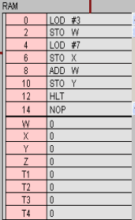
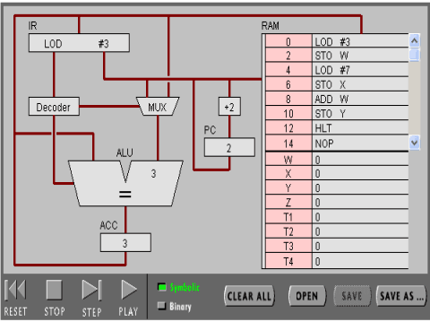
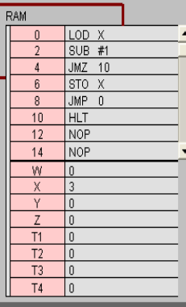

# 实验：
姓名：彭炯雯 
学号：18342083

## **实验目标**

1.了解 CPU 中各组件的作用； 
2.了解并初步使用汇编语言； 
3.总结高级语言与机器语言的联系与区别。  

## 实验过程：

任务 1：简单程序

(1)输入 Program 1。

(2)点击step after step，观察，回答。

**·** **PC**

作用：存放下一条指令所在单元的地址。

**·** **IR 寄存器**

作用：存放当前从主存储器读出的正在执行的一条指令。

**·** **ACC 寄存器**

全称:Accumulator 

作用:主要用于完成数据的算术和逻辑运算，可以存放数据或中间结果。

**·** **用“LOD #3”指令的执行过程，解释Fetch-Execute周期**

(1)PC根据地址通过地址总线从RAM取出指令LOD #3；
(2)指令通过数据总线传入IR，指令传入Decoder，数字3传入MUX；
(3)指令传入ALU，数字3传入ALU；
(4)数字3传入ACC并保存。

**·** **用“ADD W” 指令的执行过程，解释Fetch-Execute周期**

(1)PC根据地址通过地址总线从RAM取出指令ADD W；
(2)指令通过数据总线传入IR之后传入Decoder；
(3)MUX分解指令将加法运算符存入ALU；
(4)ALU从ACC中取值；
(5)IR访问RAM中的W，从W中取值；
(6)W的值读入ALU；
(7)ALU进行加法运算，将所得结果存入ACC。

**·** **“LOD #3” 与 “ADD W” 指令的执行在Fetch-Execute周期级别，有什么不同？** 

“LOD #3”指令只需访问RAM一次,而“ADD W” 指令需要访问RAM两次。 

(3)点击“Binary”，观察，回答。

**·** **写出指令 “LOD #7” 的二进制形式，按指令结构，解释每部分的含义**

00010100 00000111 
前一个为指令操作,后一个为操作数。

**·** **解释 RAM 的地址**

可以随时存取，用于暂时存放指令和数据，一旦关闭电源其中的指令和数据就会丢失。

**·** **该机器 CPU 是几位的？** 

8位。 

**·** **写出该程序对应的 C 语言表达**

int w = 3;
int x = 7; 
int y ; 
y = x + w;

任务 2：简单循环

（1） 输入程序Program 2。

**·** **用一句话总结程序的功能**

使X从3开始逐渐减一，直到其等于零为止。

**·** **写出对应的 c 语言程序**

int X = 3;
do
    --X;
while (X <= 0)
    return X;

（2） 修改该程序，用机器语言实现 10+9+8+..1 ，输出结果存放于内存 Y

**·** **写出 c 语言的计算过程**

int x = 10; 
int w = 0; 
while(x > 0){ 
    w += x; 
    --x; 
} 
return w; 

**·** **写出机器语言的计算过程**

0000000 00010100 00001010 
0000010 00000101 10000001 
0000100 00010001 00000001 
0000110 00000101 10000000 
0001000 00000000 10000001 
0001010 00000101 10000000 
0001100 00000100 10000000 
0001110 00001101 00010010 
0010000 00001100 00000100 
0010010 00000101 10000010 
0010100 00001111 00000000 
0010110 00001110 00000000 
1000000 00000000 
1000001 00000000 
1000010 00000000 

**·** **用自己的语言，简单总结高级语言与机器语言的区别与联系。**

区别：高级语言更接近人类的思维方式，更便于阅读；机器语言更贴近硬件，能为计算机所读懂，但不利于人类阅读使用。
联系：高级语言和机器语言都有类似的功能与结构，包括顺序、循环等，高级语言经过编译可以转为机器语言，它们筑起连接人类与机器沟通的桥梁。