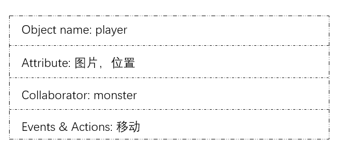
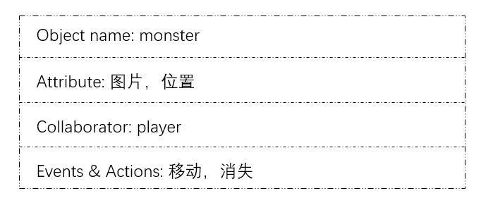
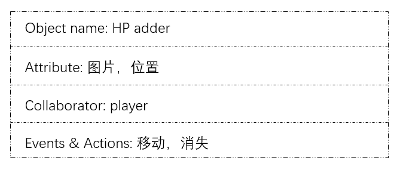
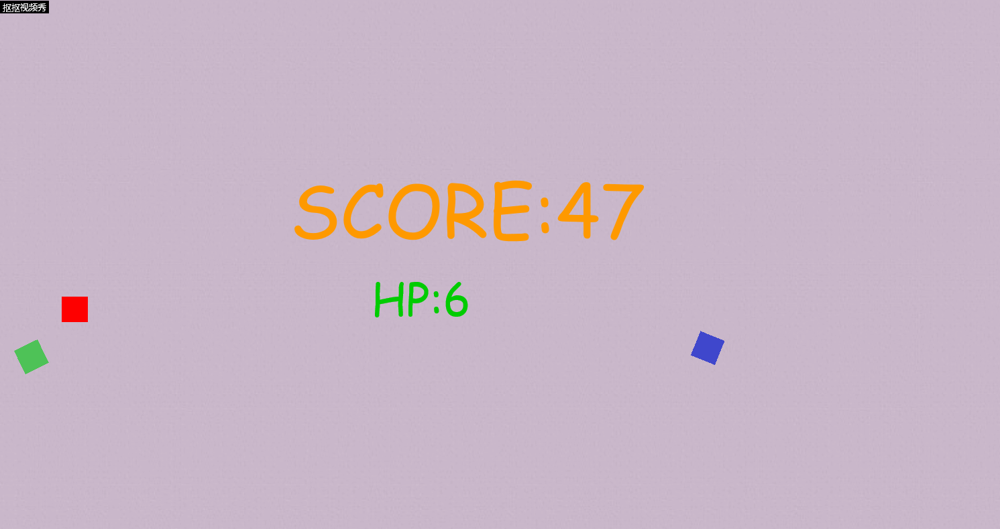

## HTML5游戏《Ball ball你放过我！》

### **游戏策划**
*Setting*:

&emsp;怪物星球的怪物们听说你眼疾手快，把你抓到了他们的地盘上与他们决斗，一对多的你，准备好了吗？

*Gameplay*:

&emsp;1、红色小方块代表玩家，可以自由移动，游戏开始时初始生命值（HP）为3；蓝色小方块代表怪物，当玩家的红色小方块触碰到怪物时，生命值（HP）减1；绿色小方块代表能量，当玩家的红色小方块“吃下”能量时，生命值（HP）可加1。生命值为0时游戏结束。

&emsp;2、每经过5s，得分会增加3；每“吃下”一个能量，得分会增加10；但每碰到一个怪物，得分会减少5。

&emsp;3、能量出现位置随机且保持不动；怪物随机出现且移动速度较快。

&emsp;4、随着游戏的进行，怪物会越来越多，这意味着游戏难度增加，玩家必须尽量躲避怪物的袭击并应设法“吃到”能量。祝你能在游戏中取得高分！

### **游戏设计**

### **游戏最终效果：**

