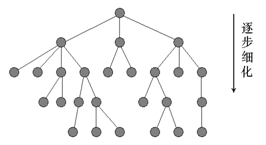
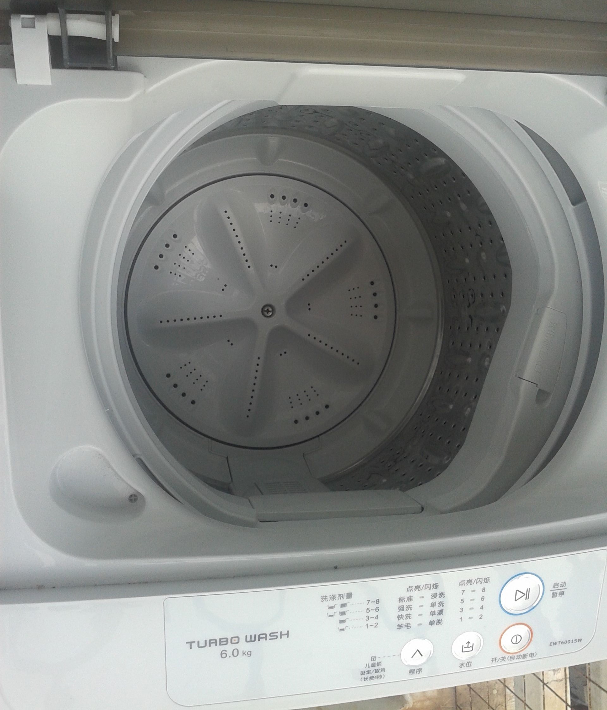

# 简述“自顶向下，逐步求精”的编程方法

&emsp;&emsp;有时候我们解决问题时无法一步到位，或者问题十分复杂，难以用线性思维解决，这时我们就要将问题分解成简单的几个子问题，自上而下对其解构，分别解决各个子问题；在将问题进行抽象化处理后，到最后的子问题求解时已经非常明了，容易对问题进行深入剖析，细化解决方法，最终通过实现数个完成子问题来解决问题，这便是“自顶向下，逐步求精”。

&emsp;&emsp;&emsp;&emsp;&emsp;&emsp;&emsp;&emsp;&emsp;&emsp;&emsp;&emsp;&emsp;&emsp;

&emsp;&emsp;该方法由著名的瑞士计算机科学家尼古拉斯·沃斯于1971年提出，基于其开发程序设计语言和编程的实践经验，他于4月份的 Communications of ACM上发表了论文“通过逐步求精方式开发程序’(Program Development by Stepwise Refinement)，首次提出了“结构化程序设计”(structure programming)的概念。这个概念的要点是：不要求一步就编制成可执行的程序，而是分若干步进行，逐步求精。第一步编出的程序抽象度最高，第二步编出的程序抽象度有所降低……最后一步编出的程序即为可执行的程序。结构化程序设计方法也就是“自顶向下，逐步求精”法，在程序设计领域引发了一场革命，成为程序开发的一个标准方法，尤其是在后来发展起来的软件工程中获得广泛应用。

&emsp;&emsp;那么，这种方法究竟是如何应用的呢？下面笔者将用洗衣机的例子来说明。

&emsp;&emsp;一般来说，一个洗衣机要实现洗衣的功能，必不可少地就有进水，洗涤（漂洗），排水，脱水等程序。将洗衣流程进行程序块的划分，这是第一次分解问题。

&emsp;&emsp;对于每个程序，都须由一系列的操作来实现。比如说，进水时，不仅要打开进水开关，还要通过水位计来确定当前水位；漂洗时，电机转动，计时器也要同步计时，确定漂洗时间等。将洗衣程序分割为不同的操作来运行，是问题的第二次分解。

&emsp;&emsp;在每一个操作中，不可避免地会暴露一些细节问题，即当洗衣机运行出现故障或受某些因素干扰时，应当如何应对，这时我们要对操作再次细分，进行优化、补充，这是问题的第三次分解。

&emsp;&emsp;至于每一个细分的操作要如何用代码来实现，则是问题的最后一次分解，这个时候想要通过代码来实现的功能已经非常细化明了了，因此编程也就变得非常简单了。

### **下面笔者将用伪代码代替可编译代码来实现洗衣机的洗衣功能，如下：**

Electricity ON

READ function choice  
READ water line, time

REPEAT

REPEAT 
    add water 
UNTILL current water level = water line 
REPEAT  
    soak 
    time = time - 1  
UNTILL soaking time = 0 
WHILE (Motor starting time > 0) 
REPEAT  
    rotate 
    time = time - 1  
ENDWHILE 
WHILE(current water level！=0) 
    drain 
    IF(water level unchanges) 
        ring 
    ENDIF 
ENDWHILE

UNTILL(water_out conforms standard)

WHILE（Dehydrating time > 0） 
REPEAT 
    dehydrate 
    time = time - 1 
ENDWHILE

Electricity OFF

&emsp;&emsp;

&emsp;&emsp;通过对具体例子的分析，我们粗略了解了“自顶向下，逐步求精”的方法，可以看出该方法对于比较复杂的问题的求解非常的行之有效，尤其是问题的模块化使得一些细节问题清楚明了便于解决，因此在碰到比较棘手的问题时可不妨尝试使用该方法。
