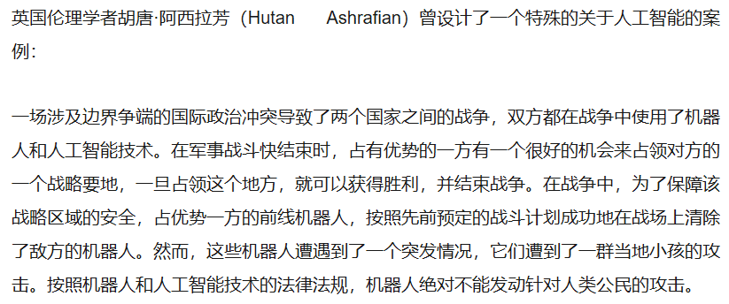
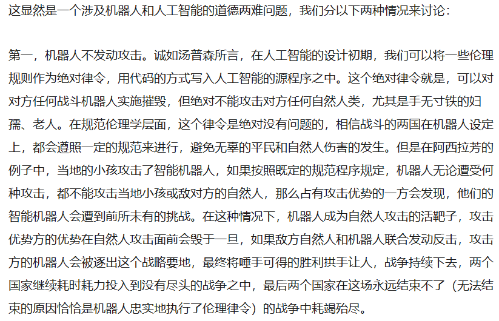
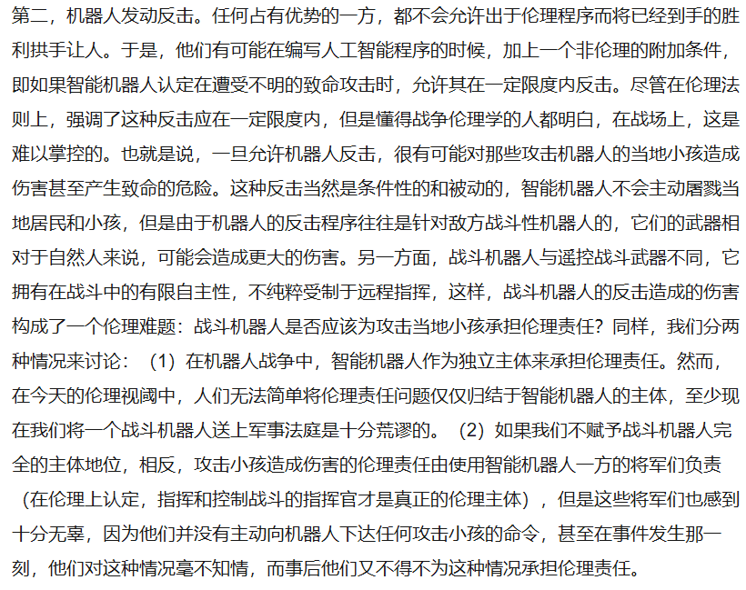
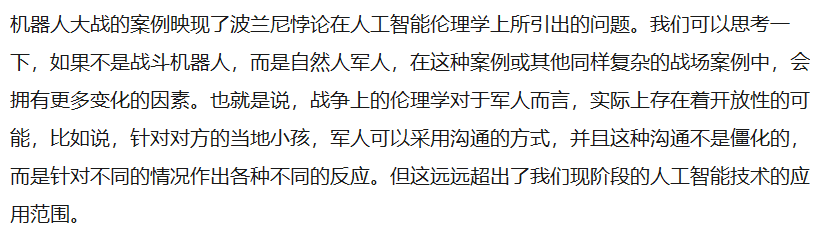

# 从可实践性看AI技术与伦理

&emsp;&emsp;人工智能的出场及其迅速发展，引发了人们对人工智能的关注，不仅仅是其技术的发展，更重要的是，人与人工智能之间的关系是竞争、敌对，还是协作、共存？这是人工智能带给我们的伦理问题的思考。

&emsp;&emsp;
(“波兰尼悖论”提出了“我们知道的，可能比我们可言说的多”的观点。)

&emsp;&emsp;实际上，在今天人工智能的设定中，一些工程师和科学家认为，如果道德律令是可以推演的，那么我们就可以完全让机器人或人工智能具有与人类一样的伦理规范和实践理性。但是，另一种伦理学坚持认定应从具体的情境和实践来思考伦理学问题，也就是说，人们在具体生活中所遇到的伦理行为，实际上要远远多于被明确提出的道德律令。规范伦理学实际上不能穷尽一切伦理状态，正如美国伦理学家伯纳德·威廉斯在批判这种单纯的义务论或规范论伦理学时指出：“道德误解了义务，看不到为什么义务只构成伦理考虑的一种形态。它误解了实践必然性，认为它是伦理领域所特有的。它误解了伦理实践必然性，认为它单属于义务。”

&emsp;&emsp;那么受波兰尼悖论的限制，人工智能还无法真正达到实践伦理学的完备层次，尽管从规范伦理学上来说，可以将伦理规范和道德律令植入到人工智能之中，但是这种植入会遭遇到例外状态下的波兰尼悖论，这势必意味着，至少在伦理学上，将人工智能和机器人视为与人类对等的道德主体仍然存在巨大问题。赋予人工智能和机器人独立的人格主体，这是伦理学在今天必须长期讨论的问题。

&emsp;&emsp;

&emsp;&emsp; 

&emsp;&emsp;

引用：https://www.sohu.com/a/218357876_696411