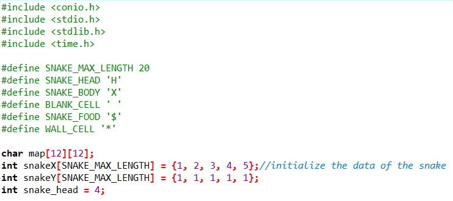

# 智能蛇探索之路
&emsp;&emsp;港真，贪吃蛇尤其号称“智能蛇”的那位真不是个容易捣鼓的东西，为了祭奠死伤无数的脑细胞，特此记录下整个探索历程。

### **低配贪吃蛇**
&emsp;&emsp;首先是需要人工操作的贪吃蛇，这一部分涵盖了大多数游戏所需要的基本操作。

**游戏基本设定：**

&emsp;&emsp;给定一个10 * 10的字符矩阵表示蛇的生存空间，其中有一条长度5的蛇 ( HXXXX )，“H”表示蛇头,“X”表示蛇身体。空间中可能有食物（“ $ ”表示）和障碍物（“ * ”表示）。 
&emsp;&emsp;玩家使用“ ADWS ”按键（大小写均可）分别控制蛇的前进方向“左右上下”，当蛇头碰到走出边界或自己的身体时，游戏结束，否则蛇将按照玩家指定方向前进一步。 

&emsp;&emsp;以下是给出的程序框架伪代码：

**贪吃蛇的程序框架**

	输出字符矩阵
	WHILE not 游戏结束 DO
		ch＝等待输入
		CASE ch DO
		‘A’:左前进一步，break 
		‘D’:右前进一步，break    
		‘W’:上前进一步，break    
		‘S’:下前进一步，break    
		END CASE
		输出字符矩阵
	END WHILE
	输出 Game Over!!!

**·** 变量定义及宏定义

**·** 设置蛇可活动的空间，该部分也可选择直接打表

**·** 将蛇头与蛇身同坐标对应

**·** 通过改变蛇头和蛇身坐标使蛇看起来“移动了”的函数，是游戏的核心函数

**·** 利用随机函数随机放置食物

**·** 打印画面 

**·** 判断蛇是否触犯边界或触碰自身，返回一个类似bool类型的值

**·** 清空屏幕，调用所有构成画面的函数 

**·** 主函数，除了调用函数的部分，读入玩家输入的key并执行相应操作 

&emsp;&emsp;利用以上代码实现的是读入玩家输入的key，将屏幕清空，修改数据并重新打印，再判断是否触碰到障碍或蛇身，是则出现“游戏结束”的字样并无法再对蛇进行操作，否则游戏继续。

&emsp;&emsp;由于实现的是字符版本的贪吃蛇，故蛇每走一步屏幕都会闪一下，游戏体验略差。

### **勉强高配智能蛇**
&emsp;&emsp;为了让贪吃蛇具备自我行动能力，我们需要设计相关函数来让程序自动计算路径并自主移动。以下是给出的函数及程序框架伪代码：

**决定蛇行走的方向函数的伪代码**

    // Hx,Hy: 头的位置
    // Fx,Fy：食物的位置
	function whereGoNext(Hx,Hy,Fx,Fy) {
	// 用数组movable[3]={“a”,”d”,”w”,”s”} 记录可走的方向
	// 用数组distance[3]={0,0,0,0} 记录离食物的距离
	// 分别计算蛇头周边四个位置到食物的距离。H头的位置，F食物位置
	//     例如：假设输入”a” 则distance[0] = |Fx – (Hx-1)| + |Fy – Hy|
	//           如果 Hx-1，Hy 位置不是Blank，则 distance[0] = 9999
	// 选择distance中存最小距离的下标p
	// 返回 movable[p]
	}
代码实现：

**智能蛇的程序框架**

	输出字符矩阵
	WHILE not 游戏结束 DO
        wait(time)
		ch＝whereGoNext(Hx,Hy,Fx,Fy)
		CASE ch DO
		‘A’:左前进一步，break 
		‘D’:右前进一步，break   
		‘W’:上前进一步，break   
		‘S’:下前进一步，break    
		END CASE
		输出字符矩阵
	END WHILE
	输出 Game Over!!!
	
&emsp;&emsp;前文已描述蛇移动等的基本操作，故这里只给出智能蛇的主函数部分，较低配版贪吃蛇略有改动。

&emsp;&emsp;最后让这个IQ仅有二百五十的智能蛇秀一波吧~

&emsp;&emsp;

&emsp;&emsp;

&emsp;&emsp;

&emsp;&emsp;

&emsp;&emsp;

##### 注：以上代码有所借鉴，侵删。

