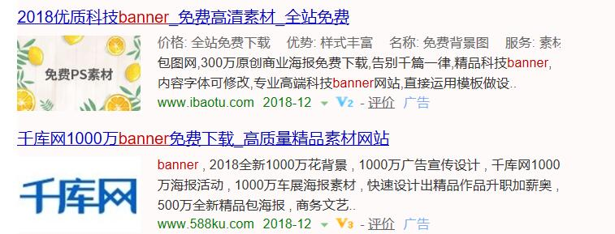
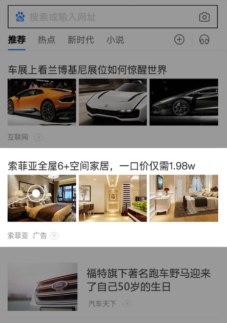

# 对于互联网时代盈利模式，你了解多少？

&emsp;&emsp;在互联网上有这样一句话：“流量聚集之处，金钱必将如影随形。”一句话揭示了流量对于互联网企业发展而言的重要性，也直接点明了流量在盈利模式中的重要地位。

&emsp;&emsp;按照百度百科的解释，流量指在一定时间内打开网站地址的人气访问量。互联网公司的估值模式，很重要的指标就是流量，包括注册用户数量、活跃用户数、用户访问频率等，一个注册用户1000万的互联网产品，没有任何的盈利，就可以估值数亿美元，在互联网领域是常有的事。在用户数量、活跃度这些指标的背后，是对用户注意力的一种占有。流量的本质是用户关注度，当你源源不断的受到关注时，你便成为一个“窗口”，金钱自会随之而来，流量自会转为商业价值。

&emsp;&emsp;比如说QQ，若没有当初免费下载的坚持，也不可能有今天的企鹅帝国；比如说微信，若没有大量的流量支撑，微信也不可能在多个领域全面开花。在“眼球经济”时代，企业只有先把流量做上去，才有更多的机会去考虑今后的路该怎么走，否则，能否在市场竞争中生存下去都会成为问题。

&emsp;&emsp;可见，在互联网时代，流量就是金钱。而当下互联网的三大主流盈利模式亦多以流量为核心。
## **互联网三大盈利模式**
### · 广告
&emsp;&emsp;广告可以说是互联网上最常见的盈利方式了。在各种门户网站上，几乎都有各种醒目的banner广告，主流的搜索引擎网站上还会有一系列根据用户历史搜索的关键词而“量身定做”的匹配广告。广告无处不在，互联网世界也不能例外，甚至，每年通过广告产生的收益占据了互联网整个行业营收的重要部分。

&emsp;&emsp;其中，精准投放的关键词广告盈利能力最强。以Google搜索为例，Google的搜索广告一般按照CPC（Cost Per Click）的方式计价，也就是说，这种广告展现免费，而当产生有效点击时才会收费。在Google的搜索结果页面上，广告位的数量是有限的，当有多个广告竞争同一广告位时，同等条件下，愿意花更多钱的广告，被展现在结果页面中的概率越大，从而获得有效点击的概率也就越大。正因如此，Google的关键词广告已经成为了Google的主要收入来源之一。

&emsp;&emsp;广告凭借其无处不在的特点“拉拢”流量，甚至采用“精准投放”的手段对潜在流量产生巨大的吸引力，可谓流量之王啊！

### · 平台佣金抽成
&emsp;&emsp;大多数互联网巨头都属于平台模式。平台不直接生产创造价值，而是通过连接不同商业群体来整合资源。像美团、滴滴、天猫、携程等，均是通过促成团购、打车、酒旅、外卖等商业交易，并从中提取一定的佣金而盈利。这种方式就像房地产中介里的链家，一头对接房东，另一头对接买房者，当交易达成时抽取2%的费用作为佣金。

&emsp;&emsp;拿天猫来说，如果一个商家想在天猫上开店，则需要向天猫缴纳下面这些费用： 
　　●保证金 
　　●技术服务年费 
　　●技术服务费率

&emsp;&emsp;其中“技术服务费率”是天猫的主要盈利模式之一。每一件商品成交后，天猫都会从成交额中收取一定比率的“服务费”，不同类别的商品费率不同。例如按照2016年的标准，如果在天猫上成功卖出一本图书，天猫会按照2%的比例抽取服务费；而如果成功卖出一套卫浴用品，则需要缴纳5%的服务费。天猫每天的成交量巨大，靠着收取服务费，每天都会产生大量的盈利。

&emsp;&emsp;这种方式不外乎就是：只要你交易我就躺着挣钱。然而这种模式要求平台具有足够的影响力，一般只有巨头们可以玩得动。也就是说，平台首先要具备一定的流量基础才能有进一步的盈利空间，这也是为什么尽管天猫做到如今如此大的规模仍在不定时地进行促销活动或投放广告，毕竟流量是要靠热度的。

### · 增值服务

&emsp;&emsp;增值服务是指根据客户需要，为客户提供超出常规服务范围的服务，简单来说就是提供特权服务。

&emsp;&emsp;互联网中增值服务模式最典型的当然要数腾讯，游戏道具、QQ秀、虚拟币、各种会员等都属于增值服务。实际上大多数互联网游戏的盈利模式都属于增值服务：很多游戏可以免费玩，但是你想要更炫酷的皮肤，更强大的技能，游戏内更高的地位，你就得充值。这就是典型的增值服务——产品的基础功能免费，高级功能收费。

&emsp;&emsp;另外，包括视频网站的付费视频，也是类似的思路——基本内容免费，高级内容收费。还有典型的就是目前流行的会员制，不管是电商、视频、文学小说还是各类工具型产品，会员模式都特别常见。亚马逊、爱奇艺、优酷、在线音乐、笔记类应用……通过提供更低的价格、更高级的功能、更好的使用体验、更优质的内容等手段吸引流量，会员模式已经成为一种流行且有效的增值服务类型。

## **总结**
&emsp;&emsp;现如今，互联网的盈利模式越来越有规律可循，很多公司一开始就设计好产品清晰的盈利模式进入了自觉盈利，他们越来越有钱，财富积累的速度也越来越快。

&emsp;&emsp;滴滴从0~1，仅用了6年，估值达到800亿美元。滴滴不拥有一辆汽车，但是它的规模比任何一家出租车公司都要大很多。在互联网时代“连接比拥有更重要”，滴滴连接了2000多万个司机，微信月活用户达10个亿，微博的月活用户达4亿人，美团点评月活用户8000多万。

&emsp;&emsp;在互联网时代，流量就是金钱，有了流量，有了用户，就不愁赚不到钱。10亿用户一人一个月给腾讯创造一元收益，腾讯一个月就能赚10亿人民币。

