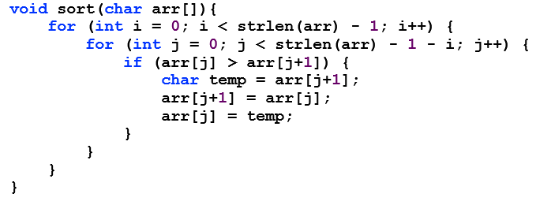

# 简述四种排序算法

### **·** 选择排序（Selection Sort）

&ensp;**原理：**

&emsp;&emsp;首先在未排序序列中找到最小（大）元素，存放到排序序列的起始位置，然后，再从剩余未排序元素中继续寻找最小（大）元素，然后放到已排序序列的末尾。以此类推，直到所有元素均排序完毕。 

&ensp;**演示：**

&ensp;**代码：**

### **·** 冒泡排序（Bubble Sort）

&ensp;**原理：**

&emsp;&emsp;重复地走访过要排序的数列，一次比较两个元素，如果它们的顺序错误就把它们交换过来。走访数列的工作是重复地进行直到不再需要交换，也就是说该数列已经排序完成。

&ensp;**演示：**

&ensp;**代码：**

### **·** 插入排序（Insertion Sort）

&ensp;**原理：**

&emsp;&emsp;通过构建有序序列，对于未排序数据，在已排序序列中从后向前扫描，找到相应位置并插入。

&ensp;**演示：**

&ensp;**代码：**

### **·** 桶排序（Bucket Sort）

&ensp;**原理：**

&emsp;&emsp;假设输入数据服从均匀分布，将数据分到有限数量的桶里，每个桶再分别排序。

&ensp;**演示：**

&ensp;**代码：**

&ensp;

&ensp;

&ensp;

动图引用：

https://www.cnblogs.com/onepixel/articles/7674659.html
https://blog.csdn.net/developer1024/article/details/79770240